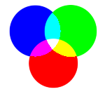

Basic concepts
##############

Colocalization
--------------

Colocalization can be interpreted on two levels:

Spatial colocalization
    Objects overlap in space. That is, for two channels, there is a bright pixel in the same place in both channels.

Intensity colocalization
    Where not only the spatial aspect plays a role, but also brighter signals in one channel correspond to brighter pixels in a second channel.

MultiColoc uses the first definition for analysis. As example, the image below, where a red, a green, and a blue signal overlab in the center. These signales are treated as colocalizing by MultiColoc

Masks
-----

Masks can be seen as images, that hold binary information, i.e. they store either a 1 or 0 in every pixel. The selection masks created by MultiColoc have a 1 in every pixel of a colocalizing signal, and a 0 everywhere else.

Take the following example, containing red and green signals

The selection mask for red colocalizing signals would be:

Conversely, the green colocalizing signals would be selected by this mask:

