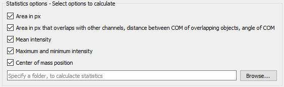

Statistics
##########

MultiColoc can not only create image masks, it can also calculate several statistics while running your analysis. These statistics are saved into CSV files, which can be imported into almost every software. Desired statistics can be selected in the options dialog.

To save statistic files, you need to specify a location where these files will be saved to. Up to two files will be generated, a *statistics* file containing general informations about each object, and a *overlap* file, if you chose to analyze overlapping signals. Both names will have a timestamp in their names.

Information in the *statistics* file
------------------------------------

channel:
    The source channel from which the objects are from. This is either the specified name, or a automatically generated name, composed of "Channel" and a number

object_id:
    The incrementing object number for this file. Each signal that is overlapping has a object number.

sourcefile:
    The source file on which the analysis has been performed

intensity_mean:
    The mean intensity. You need to specify a data file for this statistic to get calculated

intensity_min, intensity_max:
    The minimum and maximum intensity in the analyzed signal. A datafile is needed for thes values.

com_unweighted:
    The center of mass in absolute coordinates

com_unweighted_local:
    The center of mass coordinates refering only to the selected object, i.e. "Where is the center of mass in this signal"

com_weighted:
    The weighted center of mass, taking intensities into account. A datafile is needed to calculate these values.

com_weighted_local:
    The weighted center of mass, local to the signal

minimum_overlapping_area:
    The area, which is occupied by a signal in all analyzed channels.

Information in the *overlap* file
---------------------------------

The overlaps are calculated in pairs of two.

Note: Currently, all overlaps are present multiple times. If signal A overlaps with B, it will be present one time with A as reference, and then with B as reference signal.

source_channel:
    The source channel where the reference object is taken from

source_id:
    The incrementing id of the source signal

comparison_channel:
    The source channel of the overlapping signal

comparison_id:
    The id of the overlapping signal

area_in_both_channels:
    Area in pixel that is shared between both signals

distance_unweighted:
    Distance in pixel between both unweighted centers of mass

angle_unweighted:
    The angle in degree between both unweighted centers of mass

distance_weighted:
    The distance between both weighted centers of mass

angle_weighted:
    The angle between both weighted centers of mass

cumulative_overlap_A_B:
    A indicates the source channel, B indicated the compared channel. This value is a sum of all overlapping areas, and can be useful, if an object in channel A has multiple overlapping objects in channel B.